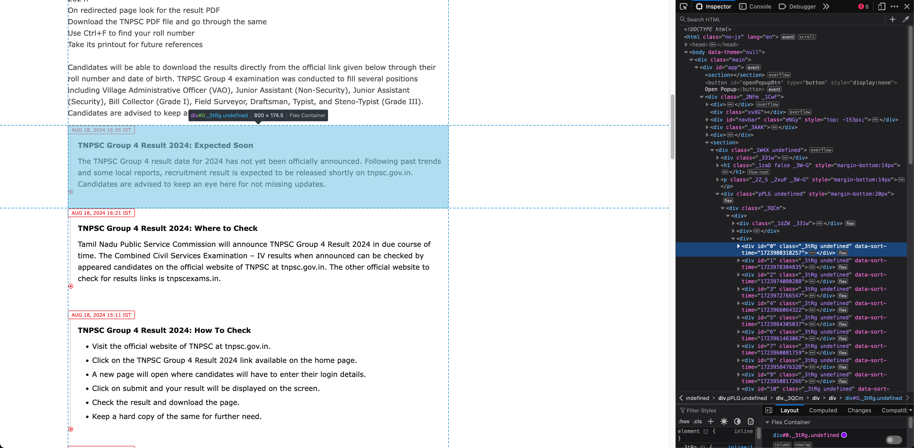

# TIMESNOW-LIVE-WITH-WHATSAPP
## Web Scraper and WhatsApp Message Automation

This script automates web scraping from a Times Now webpage and sends the scraped content via WhatsApp using Python packages `playwright` and `pywhatkit`.

## Table of Contents

- [Overview](#overview)
- [Features](#features)
- [Requirements](#requirements)
- [Setup and Installation](#setup-and-installation)
- [Configuration](#configuration)
- [License](#license)
- [Contributing](#contributing)
- [Acknowledgments](#acknowledgments)
- [Contact](#contact)

## Overview

This Python script monitors a specified Times Now webpage, extracts content based on a CSS class, and sends it to a designated WhatsApp number. It’s optimized for live updates and uses an exception set to prevent sending duplicate messages.

## Features

- **Web Scraping**: Powered by Playwright for efficient data extraction.
- **Automated WhatsApp Messaging**: Integrated with PyWhatKit for seamless message delivery.
- **Customizable Reload Intervals**: Adjust page reload frequency.
- **Headless Mode**: Option to run the browser in headless mode.
- **Robust Exception Handling**: Prevents duplicate messages by leveraging a predefined exception set.

## Requirements

- Python 3.7+
- Playwright
- PyWhatKit

### Tested On

- Python 3.10.4
- macOS Sonoma 14.6

## Setup and Installation

To set up and use this script, follow these steps:

```bash
# Clone the GitHub repository
git clone https://github.com/kumarsomeshunos/timesnow-live-with-whatsapp.git

# Navigate to the project directory
cd timesnow-live-with-whatsapp

# Create and activate a virtual environment
python -m venv venv
source venv/bin/activate  # On Windows use `venv\Scripts\activate`

# Install required packages
pip install -r requirements.txt

# Install necessary browsers for Playwright
playwright install

# Run the script
python script.py
```

## Configuration

Modify these constants in the script for your specific needs:

- `URL`: The webpage URL to scrape.
- `LOAD_TIMEOUT`: Timeout duration for page loading (in milliseconds).
- `HEADLESS`: Set to `True` for headless browser mode.
- `CLASSNAME`: The CSS class used to identify target elements on the page.
- `WHATSAPP_NUMBER`: The recipient's WhatsApp number.
- `MESSAGE_PREFIX`: Prefix added to each message.
- `RELOAD_AFTER`: Time interval (in seconds) before reloading the page.
- `RELOAD_RANDOMNESS`: Random variation (in seconds) added to the reload interval.

> **NOTE:** The target webpage's CSS class names may change frequently. Ensure you update the `CLASSNAME` constant with the latest value before running the script. Attached below is an image for your reference. (`CLASSNAME` in that image is `_3tRg`)



## License

This project is licensed under the MIT License. See the [LICENSE](LICENSE) file for more details.

## Contributing

Contributions are welcome! Fork the repository and submit a pull request with your enhancements or bug fixes.

## Acknowledgments

Special thanks to the developers behind Playwright and PyWhatKit for providing such powerful tools.

## Contact

For questions or feedback, please visit my website at [kumarsomesh.in](https://kumarsomesh.in).

---